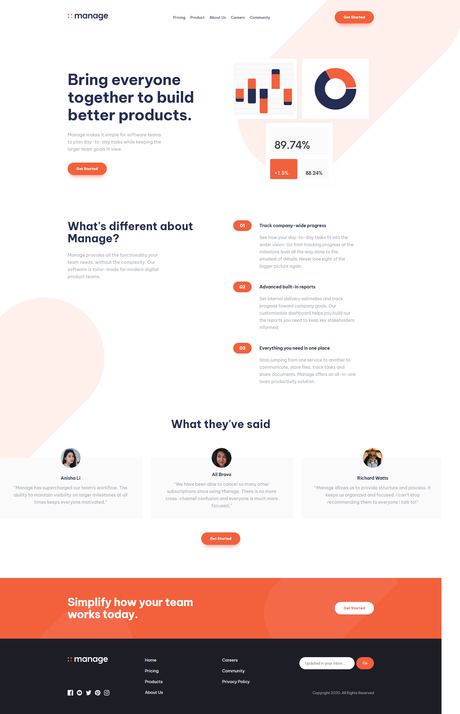
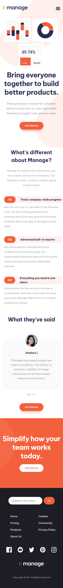

# Frontend Mentor - Manage landing page solution

This is a solution to the [Manage landing page challenge on Frontend Mentor](https://www.frontendmentor.io/challenges/manage-landing-page-SLXqC6P5). Frontend Mentor challenges help you improve your coding skills by building realistic projects. 

### The challenge

Users should be able to:

- View the optimal layout for the site depending on their device's screen size
- See hover states for all interactive elements on the page
- See all testimonials in a horizontal slider
- Receive an error message when the newsletter sign up `form` is submitted if:
  - The `input` field is empty
  - The email address is not formatted correctly

### Screenshot

I am pleased to share with you a screenshot of my solution to the manage-landing-page challenge. My goal in designing this landing page was to create a clean, visually appealing interface that provides users with all the information they need in a straightforward and intuitive manner. The page features a prominent call-to-action button, clear and concise information about the product, and a clean layout that is optimized for ease of use. I have also incorporated visual elements such as high-quality images and icons to enhance the overall user experience. I believe that my solution is a significant improvement over traditional landing pages and I am excited to hear your thoughts and feedback.

### Links

- Live Site URL: [Add live site URL here](https://manage-landing-page-seven-sepia.vercel.app/)

### Built with

- Semantic HTML5 markup
- CSS custom properties
- SASS/SCSS
- Vanilla Javascript

## Author

- Website - [Jownsu](https://jownsu.github.io/)
- Frontend Mentor - [@jownsu](https://www.frontendmentor.io/profile/jownsu)
- Instagram - [jownsu](https://www.instagram.com/jownsu/)
- Linked In - [Jhones](https://www.linkedin.com/in/jhones-digno-866904213/)